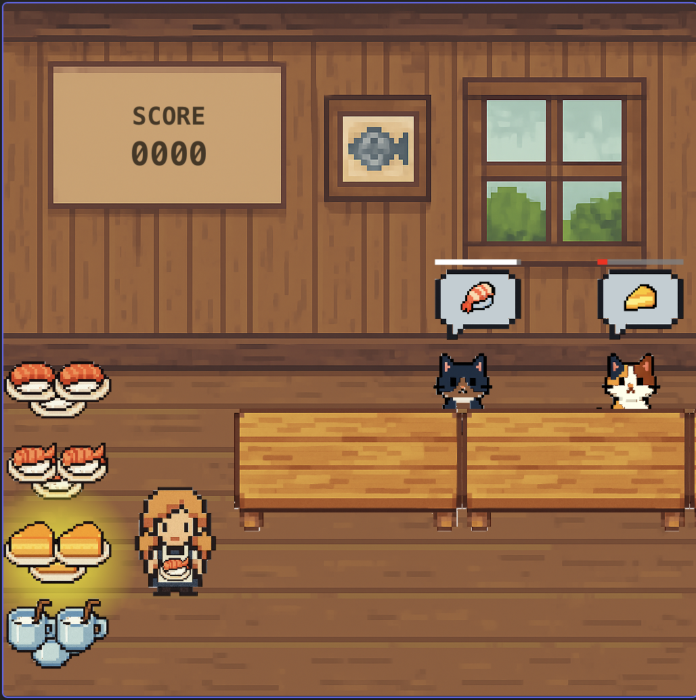

# Catstaurant

Ellie and Daddy vibe coded this game in two ~1.5 hour long sessions.

We:

- Had ChatGPT draw us graphics.
- Made our own music and sounds in Garage Band on an iPad. (The meows are from the garageband library.)
- Used vscode + GitHub Copilot + Claude Sonnet 4 + super whisper

We never hand-edited code. It's a total mess!

But: AI isn't magic. We had to work really hard to think about how to describe
the game we wanted in enough detail so that copilot could actually implement it.
In this dad's opinion, at least, _that_ is the important thing
to learn when first programming: not lines of code, but how to break down a
problem into small pieces that fit together coherently, and how to explain
each piece in exacting detail. :-)
