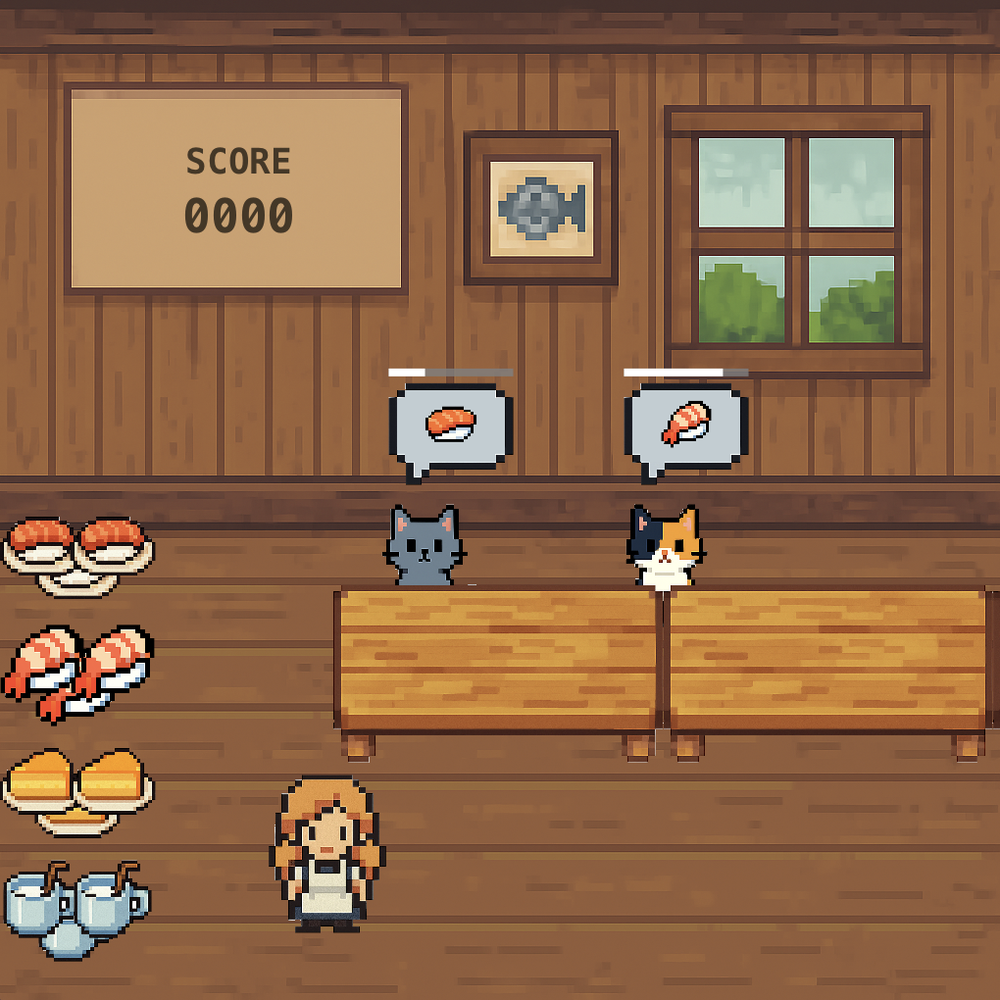

# Catstaurant

Ellie and Daddy vibe coded this game in two ~1.5 hour long sessions.

We:

- Had ChatGPT draw us graphics.
- Made our own music and sounds in Garage Band on an iPad. (The meows are from the garageband library.)
- Used vscode + GitHub Copilot + Claude Sonnet 4 + super whisper

We never hand-edited code. It's probably a mess. But we had to work really hard
to think about how to describe the game in enough detail so that copilot could
actually implement it.

And that is &mdash; in this dad's opinion, at least &mdash; the important thing
to learn when first programming: not lines of code, but how to break down a
problem into small pieces and how to explain them in exacting detail. :-)
